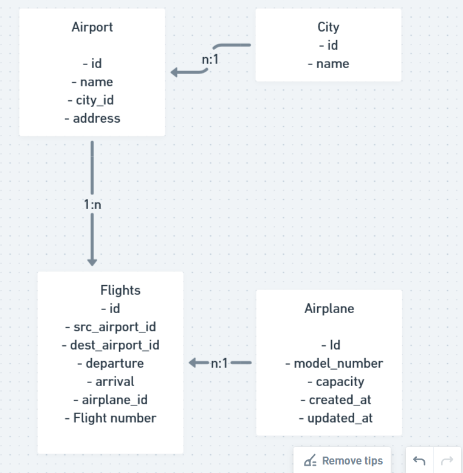

# THis is not feature based setup

src/
    index.js//server
    modes/
    controllers/
    middlewares/
    services/
    utils/(utility helpers)
    config/(database configureation etc)
    respository/

tests/[later]
static/
temp/

othere folders than src folder dont need to be loaded in server for lighter booting
that is why we use src folder seperately

Setup express js in index.js
use cjs for simplicity
require express
setup and start function 
listen 
setup nodemon start scrip npx nodemon add "start":"npx nodemon src/index.js" to scripts, then just use npm start
- Setup environmental variables for sensitive variables
- Store them in environment not in your code , that is why it wont be available for everyone to see
- Environment variables are excecsible in process, 
- We can setup up environment variables with package dotenv (look it up)
- npm i dotenv

- it is very easy to setup

- keep it outside src , create new file .env
- write PORT = 3000

- we can access it in process object, we have key env, and we have keyvariable pairs, among them you will see paths etc, you will also have port variable somewhere but first require the package as well 
- assignment look in real system environemnt variable where you have to mingw  etc

- we want to segregate this part from index.js because we want index to be only for booting

- we can keep this job for config folder ,create serverConfig.js
then do all require, call .confi etc

- now we have export port form configt to index.js
- we can use module.exports = {
    PORT: process.env.PORT,
}

- in index.js, const {PORT} = require('./config/serverCOnfig");

- commit basic setup .env
- if someone clones we have to write in readme that you have to setup .env file yourself

- There is some serious issue with this code i cant seem to figure it out and say it words but it seems it gives undefined value if i dont use npm start and just use node index.js
also we cant use await in cjs
(i have to revise previouse and have to think about what is happeing here
) 

- Ok alhamdulillah i get it , now , it is because we have to run this from root like node src/index.js
- otherwise it wont know about env file i guess. because if we put .env file in src folder it works fine with just node index.js
- Look answer from stack overflow

This is fantastic! – 
tmurv
Aug 6, 2023 at 17:36
Thanks I was running the script from task manager this solve it require('dotenv').config({path:'complete_path/.env'}) – 
ClearBoth
Aug 24, 2023 at 2:43
This is the only answer that has worked. Heads U
it means we can also use something likea bove 

HOwever best thing i think is to just use nodemon from root like we are doing till now

In production there can be multiple env files
say one for local development environmeed dev env
on production there are also env ifle prod env
again for testing server there will be other as well

so will write some more code lateron to automaticlly detect which env files to take

It is also great to do similar things together
say require together multiple modules you have to 

currently we are working locally  to local database
database server will url based locally

on aws etc that machine will have its on url
You might have noticed why have we kept asyn setupandstartserver
we will realise it after some time

- Why it is not good idea to setup sql in our aws, 
- It will cause problems, basically even horizental scalling concurrency issues etc

- setup our body pareser
- and setup middleware for this
- bodyParser.json(), bodyparser.urlencoded({encoded:true})

- now setup sequalise orm, get sequalise npm
- and setup it , apart from sequalise , install sequelize cli, it does many thing automatically and sets up database configuration
- also we also need mysql2 it is a dependency inorder to connect sequalise to mysql databasee(it provides some drivers to setup), similarly if we had to connect it to sqlite3 etc it has own dependedncy, similarly for pg sql there is pg package

- to setup sequelize a doc has been sent (i will have to figure it out myself)

- Once installed we need to do some steps, we need to configure sequelize to connect to mysql2

-sequlize cli provides some commands
- we dont need to go to mysql and say create database
- sequelize provides its interface to do same
- `npx sequelize db:create` -> create datbase by configuration (what is this configuration , we have to get those database config files)

- before executing above command we havet
- ` npmx sequelize init ` it creates some folders and files (models, migrations,seeders, config/config.json ) but outside src ,

- if we call this command from src folder then it is gonna add what it has to add but if folders already exist it will just add files  but it will override many of the things , delete services etc, add folders to ourr model folder we can bring them back from github, but it is for learning purposes, so we have to use this command carefluly
- Every one of those folders will have workings

-  we need those seeders folder etc now and just bring lets bring models folder inside
 delete internal models folder

 - i think those commands should be run while setting up environment earlier before even writing code

 - config.json has 3 set of json for  development , test production inisde config folder on root,  because differnt production enviroment require different database environment

 - Inside  now our src/model there will be a file index.js
 - we dont need to do anything with it it's sequalize code some sort of  we just might have to configure it here and there but we might not need to do anything with it

 - Note we can do all of those things manually without using cli of sequelize but it does  alot of things
 

- There is no problem with keeping seeders etc inside, for external config folder we also have inside config folder , we migh tjust copy config.json inside our /src/config folder and delete external root config foler,
although i am sure that somewhere some path value needs to be changed to access this file now since its path has change

- Seeders-> are used to put dummy data (seedup for starting information we will look into it  lateron )

- now we need to now  execture npx db:create

- but before there go to config.json and setup names of database etc, ignore production and test part

- Name -> Flights_Search_DB_DEV and password as you mysql password

- now execute npx dpcreate whatever, but it will throw error as expected but if you run this command from src folder it will run correctly

- you can now look in your databases in mysql it will have added this

- This is how can we setup this easily , we shouldnt have this confi.sjon file in git etc, we should git ignore it , src/config/config.js
  
-  Change REadme file and write down details of setting up  
 
 - Also learn how to ammend commits(if you forget to add some file to previous commit) git commit --ammend (some thing  like this)

# Check me

 - similarly setup FlightAuthService and ReminderService in same way
 
 - Read about orm and sequelize setup and other stuff like querying he has given notes but they are not available to me

 - 

 # Lets open design doc of ours

- Lets set up database which stores info of flights go to 
- What is the diff between flight and airplane?

- Before we setup flights actually what happens about db design is that one same airplane can do multiple flights

-  eg Delhi to indore and indore to bengluru same plane
## DB Design

    - Airplane Table
    - Flight Table (maintain which airplane will be used what is departure time etc)
    - Airport Table
    - City Table (we can somewhat keep ariport and city table together because airport will be in some pariticular city )
    - go to  whimsical  and setup a design

    - Generally it is recommended with that every services have different databases

### Airplane Table
    - Id
    - model_number (can be same)
    - capacity
    - created_at
    - updated_at (those last 2 help to keep track of last update very good habbit to take those track of when last created a entry and when last updated an entity)
    - (You can have luggage capacity for extra luggage  service but but lets keep it for later )

### Flights
- id
- src_airport_id
- dest_airport_id
- departure
- arrival
- airplane_id
- Flight number

### City
- id
- name

### Airport
- id
- name
- city_id (city can have multiple id)
- address(where airport is in city)
(we can keep other things here as well)

## a flight belongs  to an airplane but one ariplane can be used in multiple flights
## A city has many airports but one ariport belongs to a city
## Once airport can have many flights , but a flight belongs to one airport
(this is shown as 1:N correspondance)

Nowq how can we cre ate those tables using sequelize
for easier creation

using sequelize cli it is easier
(we have to make models because it tells how database will look like)

`npx squelize model:generate ` -> this will create model(in rdmbs it will represent table )
we can give some flags (note run this in src folder)

`npx seqeulize model:generate --name City --attributes name:String` 

--name <name of table model> -- attributes <all atribute: type>

if you see it will create a model City.js
and also in migration, it will create some file createcity.js

It will automatically have id with some propertis set like autoincrement etc look inside migration file it is interesting , also it automatically has created at updated at properties set

(if we werent using sequelize we would have to make those files ourselves)

(see naming conventions for models (some say table names should be plural camel_case)) (model class should be camelcase singlualr)

But after this if you see in mysql and use this database 
but table wont be created why so?

Because we have just made some js classes we havent yet synched them with database so we should sync right?
sequelize is powerfull however , we have migrations

they help for incremental changes to our database .(create, update)

for every incremental change we will have a migration file

its like git we make changes and commits incremently

so at some point we can use first 3 increments only rather than all (say)

we want to see incremental changes rather than wholle changes as developers

We can just run migrations and if there are any changes then they will be applied automatically

If you see  migration file
you will se query-interface (which is used by sequelize connects with databases and then does something) YOu will see that our model name was City but it will create table Cities (plural) 

we can by they way edit them ourselves those migration files , may be add attributes, like allowNull;

So basically this allows to alter tables, make changes, update etc basically very easily

bytheway sometimes changes wont sync with sequelize cli and we have to use normal sequelize , we will see ignore this line till then (carry on like you didnt read this)

- basiccally migrations help us what has changed/migrated
- In rails etc as well we use migration file
- But generally people dont use migration files, they might be syncing direclty throw sequelize

- You will see in migration file , async up and async down
- whenver we have to create table/class generally up used
- removing generally down is used

- based on migration commands we run it will either call up or down
- so We will be just using cli to those 

- But problem still remains that there are no tables yet in mysql database
- because these migration files actually give us a second chance like hey do you really wanna do this

- By the way mirgration files are not required, we can give those constraints in Models as well
 City.init({
    name: {
        type: DataTypes.STRING,
        allowNull: false
    },
})
- check sequelize models on google
- It is just that it lets us increment change.
- Note that models is at js level only(means like it makes constraints on kinda client side not on real db side. Consider client side validataion and server side validation)
- migrations act at db level

- what happens if we dont put those constraints in model file (currently have them both in model and migration file) {do experiments basically } (we will see later on)

- when all changes have been made to model and migraion

- `npx sequelize db:migrate`
-> db migrate migrates db, whatever migraions not applied yet will be applied

(it will create Cities as well as SequelizeMeta table)

-> SequelizeMeta  stores which migrations have been synced
-> if you again run same command it wont change anything and will say schema is upto date

-> now we have table (use desc table, id ,name, createdat, updated) (with default properteis and id as primary key auto-increment)

- add to git we made changes to migrations, city.js

- If someone gets from git hub, you get also migrations and model, just run db:migrate (it applies all changes one by one to our databse)

- sequelize+ cli gives it superpower(otherwise you would have to use sequleize and crate models your self, in ruby rails same thing and go to documentation of sequelize and learn defineing, init, extend etc)

-  what if we wanna rollback to some previous using undo command (we will see lateron)

-   we can try to even add id, lets try that as well, (randomly we can do many experiments)

- Say we bymistake did some migration

- `npx sequelize db:migrate:undo` -> it will revert and city will nologner be there and sequelizemeta will have empty set, check what if there were multiple migrations done, and then we run undo, what will it rollback to 

-  Now you can just do different experimienst like have have one property in model, but dont have that in migration. (which will take precidenc)

- Precedence will be taken by the migrattion file because it acts at db level
- If we use migrations then (we have to take care of it)
- 
- in modesl folder index.js does lot of things, gets required dependecies and configures tables, other important job it does is it associates with tables(we will see) 

- Now we have models and now we have to see how to interact with models, this should technically happen in repository layer 

- In service -> business logic, controllers (hitting api)

- We will add repository class (we can add it in index.js but we do segregation for a reason)

- create a file city-repository.js in src/repository

- we need to have access to models because models have funcitons like User.create() etc to add or delete data

const City = requre('../models/city');
or we can include just index file because it includes all models

const {City } = require('../models/index');
// this bracket will destructure the model and we will get City model as index will export City and other models like when we will create flights etc

because index exports db object which includes all models and you can see db.City = "City"

now remember we can update etc from index.js (server file) or any other file by City.create() etc
but we will define all of things in repository 

add some properties like unique: true to city names because it causes problem
it will throw error if something is not allowed (try block etc should be use)

we can now write code in city-repossitory.js

we can write bunch of functions or we can write classes (which are internally also just functions)

-  class CityRepository{
    async CreateCity({name }) //we are passing maybe objects here (we can pass simple parameters like)
    {
        try {

            const city = await City.create({name});
            return city;

        } catch(error){
            throw {error};
        }
    }
}

asycn deleteCity(cityId)
//we can use City.destroy({
    where: {
        id: cityId
    }
})

//by the way we can use sequelize raw quereis as well

 module.exportes = CityRepository;

 //lets use this in our index.js
 and import
 and call create city from there on do this after starting server(in where you print serving at this port)

 - if you again run server it will try to add same city again so it will throw error as we only have throwed error
 we havent gracefully handeld error inrepository 

- we will have to bind them in try catch block where ever we are using reporityoy functions,( in services we hav eour business logic and do all of these stuff of interacting with repository)

-  what if there is some complex query that we have to execute (may be will have to use raw queries as well)
- These will have to be in repository level

- Now we know almost all of things to  start project

- Now story is going to start to connect

- We should learn about how to associate two models
- google it obviously usin gsequelize and sequelize-cli

- So just set up repository and create etc

### We have completed added city repository layer

//{name:" ", otherProperty: " "} etc by destructing {name} we can directly use name property
we can have async createCity(obj){
    //here obj will have all the properties that our city row should have
}

const city = await City.create({name}); //this is tcp call it isn't  like native js call

// this is why we need await because runtime is involved and it might be asynchronous
- Learn about different functions for different queries
- search model querying
- 